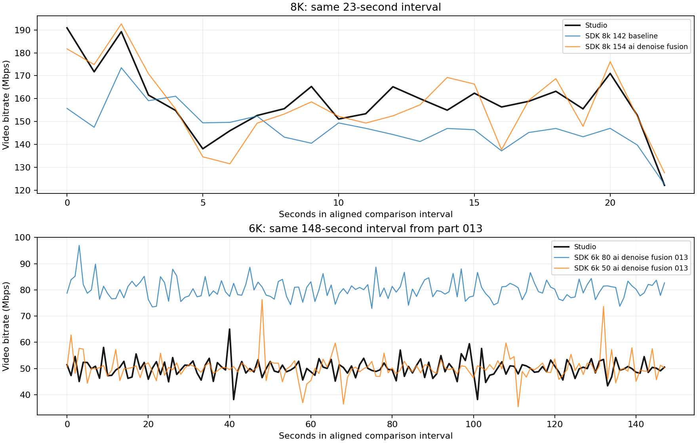

# Studio / MediaSDK 比較調査

## 現在の判定

**8Kは「ほぼできる」。6Kは「まだ判断不能」：近い候補は得られたが、位置ずれと秒単位のビットレート変動が未一致。**

8Kは同じINSVをMediaSDKTest 3.1.5で実際に変換し、Studioの全705フレームに時間を合わせて比較した。
最も近い試験条件は154Mbps、AIスティッチ、FlowState、denoise、stitchfusion。
全区間SSIM **0.981903**、PSNR **41.817091 dB**。これはStudioとの類似度であり、無圧縮の真値に対する画質評価ではない。
差分と目視でも主要な構図は一致し、細部・ノイズ・輪郭付近の差が残る。

## 重要な訂正：ビットレート設定は実ファイル内にも手掛かりがある

平均値だけでなくHEVCのHRD情報を `trace_headers` で抽出した。

| 対象 | HRD bitrate | HRD CPB size | cbr_flag | 実測平均 |
|---|---:|---:|---:|---:|
| Studio 8K | 154,000,000 bps | 308,000,000 bits | 0 | 157.664 Mbps |
| SDK 8K 142指定 | 142,000,000 bps | 284,000,000 bits | 0 | 144.637 Mbps（全長） |
| SDK 8K 154指定 | 154,000,000 bps | 308,000,000 bits | 0 | 処理条件によって変化 |
| Studio 6K | 50,000,000 bps | 100,000,000 bits | 0 | 50.015 Mbps |

8Kの154はスクリーンショットだけでなく既存MP4内部の値とも一致する。
6Kは提示された画面の80と、既存MP4内の50が一致しない。画面の設定が既存MP4生成時と同じだったとは断定できない。
50Mbpsの試験候補は平均値への決め打ちではなく、このHRD情報から選ぶ。

HRD bitrateはデコーダバッファモデル上の値であり、StudioのUI値やNVENCの全内部設定を直接記録したものではない。
ここではSDKの指定値との対応を実験で確認している。
算出式は `(bit_rate_value_minus1 + 1) * 2^(6 + bit_rate_scale)`、CPBは `(cpb_size_value_minus1 + 1) * 2^(4 + cpb_size_scale)`。
`cbr_flag=0` はHRDの間欠的な入力を示す。秒ごとの出力も変動しており「毎秒指定値に固定されるCBR」とは違う。
ただし、これだけでNVENCの具体的なRC enum、preset、lookahead、AQまで同じとは証明できない。
規定の根拠：[ITU-T H.265 Annex E.3.3](https://www.itu.int/rec/dologin_pub.asp?id=T-REC-H.265-201304-S!!PDF-E&lang=e&type=items)。

## 8Kの具体的な試験コマンド

プロジェクトの `insta360-uploader` で実行する例。出力先は新規ファイルにする。

```powershell
& '.\sdk\MediaSDK\bin\MediaSDKTest.exe' `
  -inputs 'D:\DCIM\Camera01\VID_20260905_153205_00_004.insv' `
  -output '.\analysis\insta360-studio-match\outputs\sdk_8k_match_new.mp4' `
  -output_size 7680x3840 `
  -enable_h265_encoder `
  -bitrate 154000000 `
  -stitch_type aistitch `
  -enable_flowstate `
  -enable_denoise `
  -enable_stitchfusion `
  -camera_accessory_type 0
```

アクセサリ0は実行済み試験のデフォルト値を明示したもの。モデルはexe隣の `models/` を自動参照。
既存の最良試験動画は `../outputs/sdk_8k_154_ai_denoise_fusion.mp4`。

## 6Kの実測と具体的な候補コマンド

8Kで処理条件を絞った後、短い後半ファイル `_013.insv` を80Mbpsと50Mbpsで変換した。
Studio版の全58,377フレームを解析済み。SDK版は短い後半のみを実際に生成・解析した。
長い前半 `_012.insv` をこの候補で新規生成した検証、および2本から単一MP4にする検証は行っていない。

SDK frame 0にStudio frame 53,940が対応し、SDK frames 300/2100/3900の独立照合でも同じ対応だった。
共通4,437フレーム（148.0479秒）を比較した。

| 共通区間の値 | Studio | SDK 50Mbps | SDK 80Mbps |
|---|---:|---:|---:|
| 実測平均Mbps | 50.024743 | 50.327208 | 80.208243 |
| Iフレーム平均bytes | 995,011 | 946,464 | 1,545,616 |
| Pフレーム平均bytes | 181,510 | 184,490 | 292,745 |
| Bフレーム数 | 0 | 0 | 0 |
| GOP | 30 | 30 | 30 |
| 完全な1秒区間の最小Mbps | 38.149 | 35.372 | 72.912 |
| 同・最大Mbps | 65.017 | 76.317 | 96.970 |
| 同・CV | 0.06815 | 0.09330 | 0.04628 |
| Studioとの秒単位相関 | 1 | -0.00931 | 0.01637 |

50Mbpsは平均が近いだけでなくHRD bitrate/CPBと抽出したヘッダ数値もStudioと一致した。
しかし秒単位の変動が相関しておらず、内部rate-controlの挙動まで一致したとは判断しない。
固定カメラで同じ室内を撮影した区間のため、8Kの移動撮影と同じ変動特性を期待できるとは限らない。

50Mbps候補の全共通区間：**PSNR 32.526899 dB、SSIM 0.961520**。
代表3区間はPSNR 32.443/32.494/32.615 dB、SSIM 0.961211/0.961132/0.962184。
80Mbpsの代表区間はPSNR 32.423/32.478/32.607 dB、SSIM 0.960242/0.960452/0.961872。
80Mbpsへ増やしてもStudioとの類似度は改善しなかった。

追加で50Mbps/AI/stitchfusionのままdenoiseをOFFにした試験も行った。
共通区間平均50.109Mbps、秒単位相関0.0290、代表3区間のPSNR32.314/32.380/32.513 dB、SSIM0.956127/0.956632/0.957952。
denoise ONより画質指標が下がり、秒単位の相関も改善していないため、この試験ではONを候補として維持する。

位置ずれ診断では5つの領域でSDK画像を横方向に1画素対応させると差が減少した。
1画素は6K幅6016に対して球面経度約0.0598度に相当するが、真の原因が純粋なyaw回転と断定したわけではない。
診断用に1画素の位置合わせをすると代表3区間の**輝度のみ**のPSNRは35.499/35.683/35.864 dB、SSIMは0.976584/0.977133/0.977552になった。
これは未加工出力の全色成分スコアとは別の診断値。SDK出力の画素を書き換えて最終成果物にしたものではない。
分割素材を個別処理した際のFlowState基準や、スティッチ処理の差が候補だが原因は未確定。

実行済み候補を再現するコマンド：

```powershell
& '.\sdk\MediaSDK\bin\MediaSDKTest.exe' `
  -inputs 'D:\DCIM\Camera01\VID_20260906_162319_00_013.insv' `
  -output '.\analysis\insta360-studio-match\outputs\sdk_6k_candidate_new.mp4' `
  -output_size 6016x3008 `
  -enable_h265_encoder `
  -bitrate 50000000 `
  -stitch_type aistitch `
  -enable_flowstate `
  -enable_denoise `
  -enable_stitchfusion `
  -camera_accessory_type 0
```

この50Mbpsは**今回の既存Studioファイルに合わせる候補**であり、全ての6K素材に共通するデフォルト値とはしない。
先頭ファイルへ同じ条件を適用することはできるが、未検証のためここでは完成済みの一致コマンドとは表現しない。
SDKの `-inputs` 複数指定はレンズ分割素材用で、時間分割された `_012` と `_013` の連結指定ではない。

## Studio設定との対応

| 項目 | ユーザーの8K画像 | SDKでの扱い | 根拠・限界 |
|---|---|---|---|
| FlowState | ON | `-enable_flowstate` | OFF試験で大幅悪化、画像とも一致 |
| 方向ロック | OFF | 指定しない | デフォルトOFF |
| AIスティッチ | 選択 | `-stitch_type aistitch` | 光学フローより明確に改善 |
| レンズガード・潜水ケース | OFF | `-camera_accessory_type 0` | 画像と一致 |
| スティッチング色彩… | ON | `-enable_stitchfusion` が対応候補 | SDK公式でcross-lens chromatic/brightness matchingと説明される。追加で小さく改善 |
| スティッチング融合… | OFF | 同名に見えても上記と同一視しない | UIラベルが省略されており正確な機能の対応は未確定 |
| ノイズ除去 | 個別スイッチなし | `-enable_denoise` | 公式の自動処理仕様と改善実測から採用。強度の完全一致は未確認 |
| 色彩鮮やか・鮮やかプラス・色調整など | OFF | 指定しない | 追加色調整をしない |
| ティルト・リカバリー／微振動補正 | OFF | 対応する独立CLIなし | OFFなので今回の主要差とは考えにくい |

SDKのstitchfusionの説明：[公式Media SDK API](https://insta360develop.github.io/Insta360-Developer_Docs/en/x/desktop/media/)。
X4 Airなどの元素材はStudioがノイズ除去の必要性と強度を自動判定し、個別スイッチを出さない：[公式Remove Grain説明](https://onlinemanual.insta360.com/studio/en-us/operation-guide/file-management/ai-processing-image-noise-reduction)。

## 時間合わせと比較の限界

- 8K元INSVは2レンズの各883フレーム、SDK出力884フレーム、Studio出力705フレーム。
- Studio frame 0にSDK frame 89（2.969633秒）が最もよく対応する。グレースケール全体の照合で、隣接フレーム候補とは大きな差がある。
- 全区間品質比較はStudio 705フレームとSDKの対応705フレーム。代表区間はStudio frames 60–89、330–359、630–659、各30フレーム。
- 素材は屋外の移動撮影。厳密な静止シーンを含む試験とは言えない。早期・中間・後期の区間と、道路・建物・植生の細部を比較した。
- キーフレームは両方30フレーム周期だが、Studioのカット開始位置とSDKの開始位置が異なり、同じ被写体時刻でI/Pの位相がずれる。フレームサイズ差・画質差の一部にはこの影響もあり得る。
- SDKの開始・終了トリムと時間分割INSVの連結を行う公開CLIは確認できない。今回のSDK出力は元全長。Studioと同じ長さ・同一MP4を生成できたとは言わない。
- PSNR/SSIMは球面上の面積重みを付けないequirectangular全画素比較。投影歪みや視聴時の注目領域を重み付けしていない。

## SDK仕様・公開範囲

- 実行時SDKバージョンとDLLプロパティは3.1.5。MediaSDKTest.exe自身に独立のFileVersionは空欄。SHA-256は `sdk_inventory.json`。
- `example/main.cc` で `-bitrate` → `atoi` → `output_bitrate` → `SetOutputBitRate(output_bitrate)` を確認。ヘッダの単位はbps。
- 公開ヘッダとCLIパーサにCRF/CQ/QP、RC方式、preset、GOP/B-frame、lookaheadの独立指定は見つからない。
- DLLにはRCやQP関連の文字列があるが、それがCLIから指定可能という根拠にはしない。`sdk_binary_strings.json`参照。
- ソースと実行ヘルプのオプションは整合する。ただし付属ソースとexeのビルド同一性までは検証していない。
- 実際のログはHEVC/NVENC、ハードウェアデコード、8bit出力を報告する。
- verboseログでは `video bitrate:154000000`、`bframes:0`、`gopSize:30` を確認。具体的なRC enum/presetの設定値はログにも出なかった。
- Studioの画面にあるティルト・リカバリー、微振動補正、ポートレート、モーションND、アクアビジョン等に相当する独立した公開CLI/APIは、今回のヘッダとパーサでは確認できなかった。自動ノイズ除去の強度や判定閾値も公開されていない。画面上でOFFの機能は今回の比較に追加していない。
- `-help` はヘルプ後に入力不足判定も行うため終了コードが非0。最初のPowerShell実行は標準エラーの扱いも含むため、後続試験ではPythonで終了コード・ログを直接保存した。後続の正常変換はreturncode 0。

## 残る差の原因

**実証できた主要因は、stitch typeとdenoise。** 142→154MbpsだけではPSNR/SSIMがほぼ改善しなかったが、AI化とdenoise追加で大きく改善した。
色合わせの追加効果は小さいが一貫した。残る差はノイズ除去の内部強度、スティッチ実装・モデルの版、GOP開始位相、エンコーダ内部設定などが候補。
どれが残差の主因かを分離し切ったとは言えない。HRD・GOP・色形式が一致することだけでpresetまで一致とは断定しない。

SDKでStudioの全機能を再現できないと原理的に証明したわけではない。別エンコーダへの代替は実施していない。

## 解析ファイル

- `../*_ffprobe.json`: コンテナ・全ストリーム情報
- `../*_frames.csv` / `*_frames.json`: フレーム解析
- `../*_summary.json` / `*_seconds.csv`: I/P/B・GOP・秒単位変動
- `../*_aligned_seconds.csv`: 同じ映像時刻での比較
- `../headers_summary.json`: HRDとビットストリームヘッダ
- `../logs/*_quality_*.log`: フル解像度SSIM/PSNR。`quality_0`は8K全区間
- `detail_studio_sdk_difference4x.png`: 左Studio、中央SDK（AI＋denoise）、右輝度差分4倍。細部確認用
- `../scripts/`: 再現用スクリプト

数表は `measurements.md` に自動集計する。

`validation.json` では14組のフレームCSV/JSONについて、フレーム数・I/P/B集計・パケットサイズから再計算したbitrateが整合することを確認した。
元5ファイルのサイズも最初の確認時と同じ。元ファイルへの書き込みは行っていない。

## 次に差をさらに詰める場合

6Kの長い前半を同条件で新規変換し、分割前後で位置ずれが出るかを比較すれば、分割処理の影響を切り分けられる。
現時点では長い前半の再変換と単一MP4への連結は未検証。今回の6Kの結論を32分全体へ一般化しない。
残差の完全な説明にはStudioの自動denoise強度やSDK内部のRC/preset、連続クリップのスタビライズ基準に関する追加情報も必要になる可能性がある。


